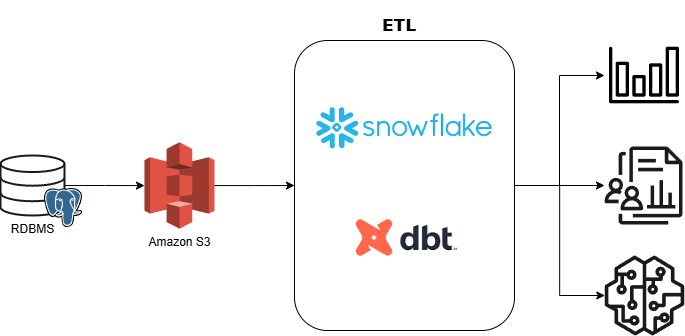
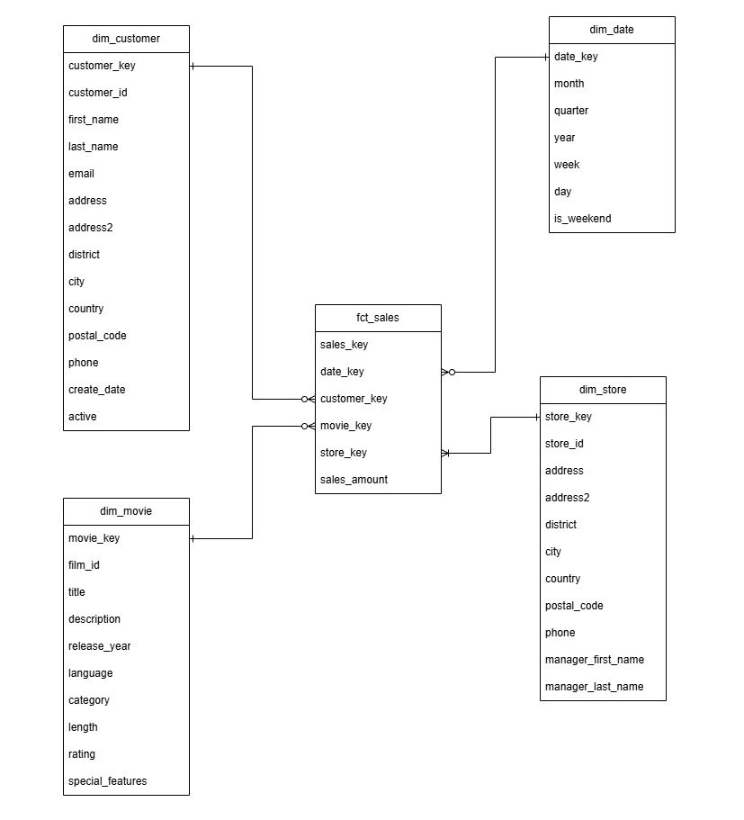

# ETL-dvdrental-snowflake-dbt

## Overview
This project demonstrates a robust ETL pipeline, replicating a typical workflow for extracting, transforming, and loading data from a transactional database (PostgreSQL) to a cloud data warehouse (Snowflake) and applying star schema before serving to the end users using DBT. This project empowers business analysts to derive insights and make data-driven decisions efficiently.

## Dataset
This project used the DVD Rental dataset. For more information please refer to this [link](https://www.postgresqltutorial.com/postgresql-getting-started/postgresql-sample-database/).

- DVD Rental ER Model:


## Project objectives
- Copy data from a relational database (PostgreSQL) to a data lake (AWS s3).
- Load the data from the data lake (S3) into a cloud data platform (SnowFlake).
- Use DBT to apply dimensional data modeling and data quality checking to the data.
- Dimensional data model:


## Prerequisites
- PostgreSQL database up and running
- AWS s3 API key, secret key, and bucket name
- Snowflake account and necessary credentials
- Python installed (with required libraries: psycopg2, boto3, snowflake-connector-python)
- DBT installed and configured

## Project structure
`./Scripts/`: contains Python scripts to load data from PostgreSQL to AWS S3 and copy data from S3 to Snowflake.

`./dvdrental/`: dbt folder, contains sql scripts and yml files (`./dvdrental/models/dvdrental/`) to create the dimensional data model and quality check.

## Setup and Execution
1. Clone the repository 
```
git clone https://github.com/huynd-git/etl-dvdrental-snowfalke-dbt
cd etl-dvdrental-snowflake-dbt
```
2. Configure connections and API keys
3. Execute the python scripts to load data from PostgreSQL to S3 and copy it from S3 to Snowflake.
4. Run `dbt run` to apply dimensional data modeling.
5. Run `dbt test` to run the quality check.

